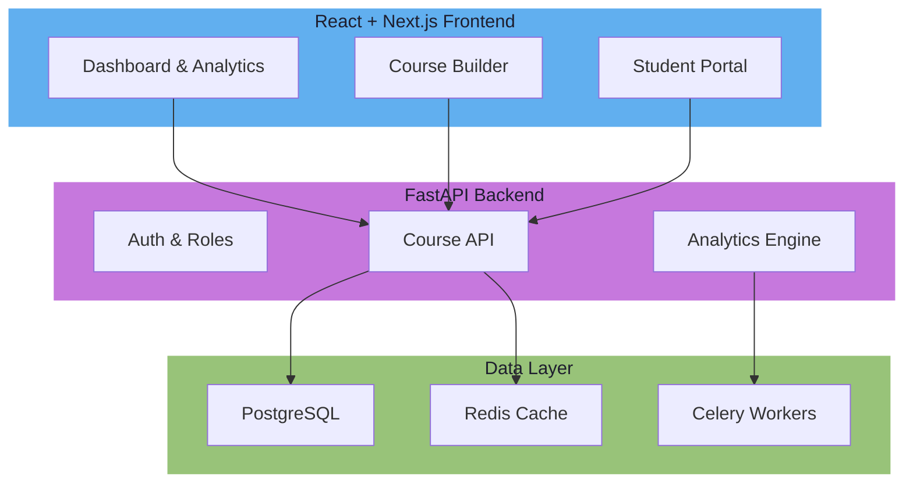
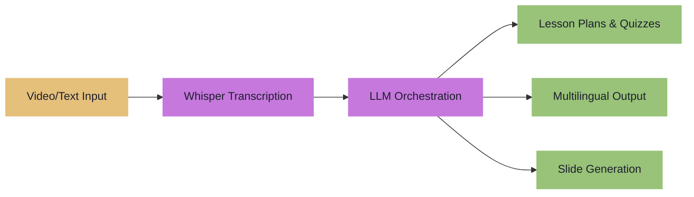
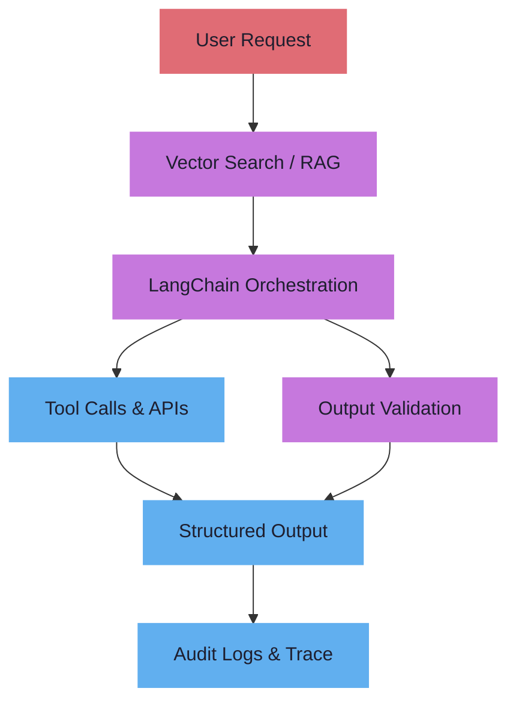

<p align="center">
  
</p>

<p align="center">
  <a href="mailto:eng.asm.89@gmail.com"></a>&nbsp;
  <a href="https://linkedin.com/in/ashrafsalmadhoun"></a>&nbsp;
  <a href="https://github.com/engasm89"></a>&nbsp;
  <a href="https://academy.eduengteam.com"></a>&nbsp;
  
</p>

<p align="center">
  
</p>

## `> whoami`
```python
# define ENGINEER "Ashraf S. A. AlMadhoun"

class AI_Engineer:
    name       = ENGINEER
    degree     = "MSc AI & Software Engineering"
    location   = "Cairo, Egypt"
    role       = "AI Software Engineer | Full-Stack Developer | Educator"
    focus      = [
        "FastAPI + React + PostgreSQL + Redis SaaS",
        "LLM Applications, RAG Pipelines & Agentic Workflows",
        "AI Content & Course Generation Platforms",
        "1.5M+ Students Taught | 500+ Hours of Content",
        "Python Automation | Docker | LangChain | OpenAI"
    ]
    status     = "Open to collaborations & consulting"
```

## `> cat /proc/skills`

| |
|---|
| **AI & LLM**     | **Backend**     |
| **Frontend**    | **DevOps**    |
| **Cloud & APIs**     |

MQL5 MQL4 ESP32 MQTT C/C++ Node.js

## `> ls ~/projects/`

### 01 &nbsp; TeachmeAnything — AI-Powered EdTech SaaS

- **Full-stack SaaS** — React + FastAPI + PostgreSQL + Redis serving 1.5M+ students
- **10+ published courses** on Coursera, Udemy, YouTube with 500+ hours of content
- **Analytics dashboard** tracking learner engagement, completion rates, and revenue metrics

### 02 &nbsp; AI Content & Course Studio

- **Transcript → Curriculum** pipeline using Whisper + GPT for automated course generation
- **70%+ content creation time reduction** for educators and instructional designers
- **Multilingual support** — English, Arabic, and regional language outputs

### 03 &nbsp; Workflow Automation Copilot

- **Agentic workflow builder** — 50+ workflow types for business automation
- **LangChain + RAG** architecture for context-aware task execution
- **Audit trail & logging** for compliance and debugging

## `> cat /etc/experience`

| Role | Organisation | Period |
|:-----|:------------|:-------|
| **AI Software Engineer & Founder** | Self-Employed / Freelance | 2023 — Present |
| **Instructor & Content Creator** | Coursera, Udemy, YouTube | 2018 — Present |
| **Lead Developer** | TeachmeAnything Platform | 2021 — Present |
| **Embedded Systems Engineer** | GTC (Global Trading Corp) | 2019 — 2021 |
| **Technical Trainer** | GGateway | 2018 — 2019 |

## `> cat /etc/education`

| Degree | Institution | Period |
|:-------|:-----------|:-------|
| **MSc AI & Software Engineering** (In Progress) | — | 2024 — Present |
| **BSc Mechatronics Engineering** | — | — |
| **Embedded Systems Diploma** | — | — |
| **ARM Cortex Diploma** | — | — |

## `> cat /etc/certs`

  

  

## `> top -b | head`

<p align="center">
  
  
</p>

## `> tail -f /var/log/activity.log`

<p align="center">
  
</p>

<p align="center">
  
</p>

---

<p align="center">
  <samp>
    <i>"The best code is written not just to work, but to teach."</i>
  </samp>
</p>
